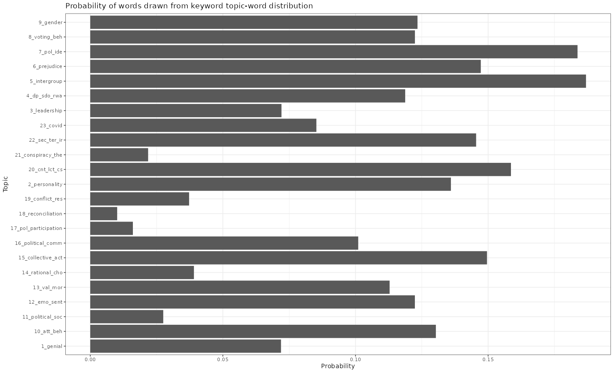

# Text Analyses of Political Psychology Articles

Pulled a sample of 1382 academic article abstracts from two main political psychology journals

- [Political Psychology](https://onlinelibrary.wiley.com/journal/14679221)
- [Journal of Social & Political Psychology](https://jspp.psychopen.eu/index.php/jspp)

Applied the following techniques:

1) EDA consists of
	- Document clustering of article titles

   - Bi-term topic modeling on article titles

2) Text map/landscape after parts of speech tagging for visualization

3) Semi-supervised (keyword-assisted topic modeling) for content analysis

